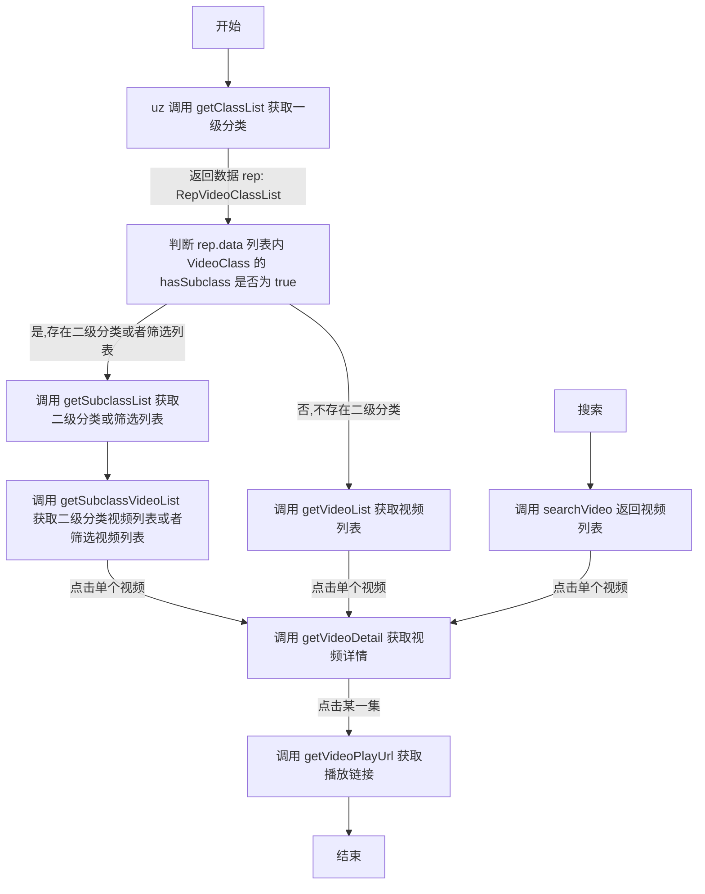
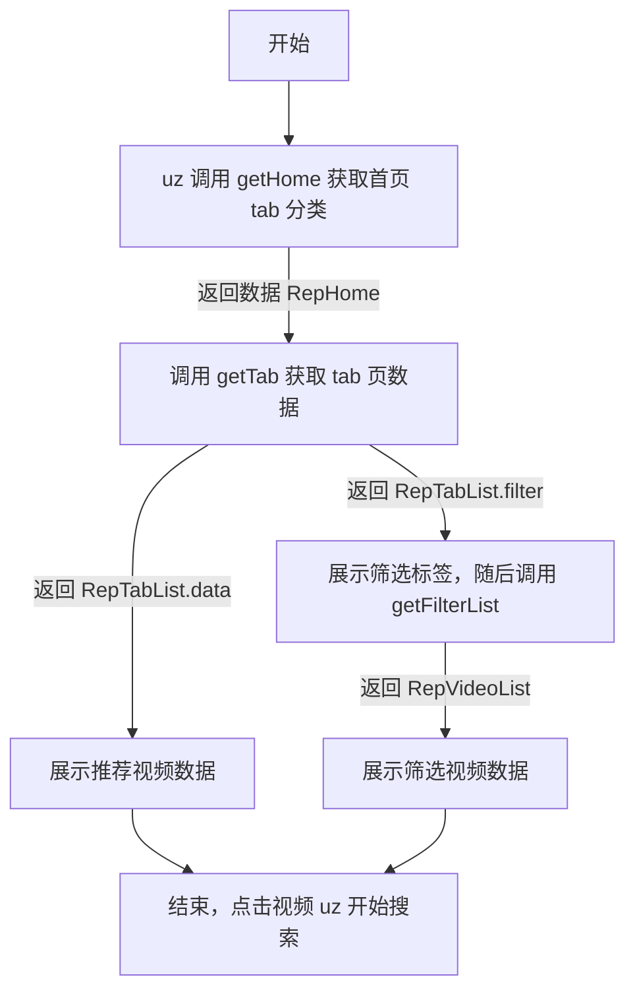
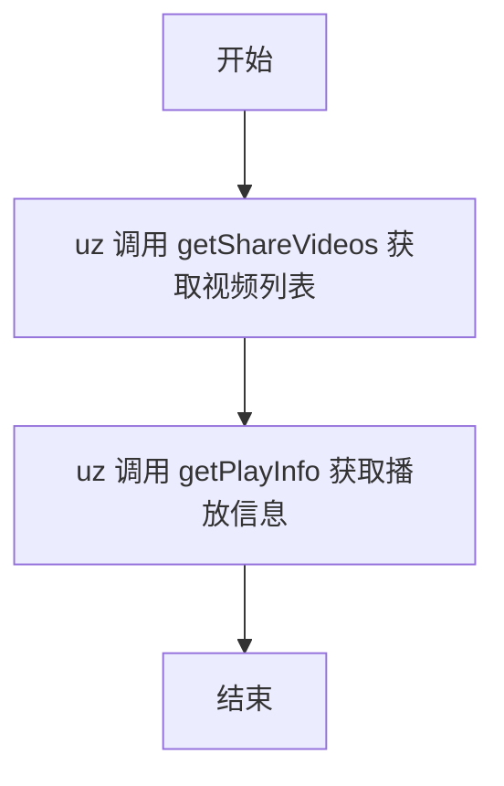
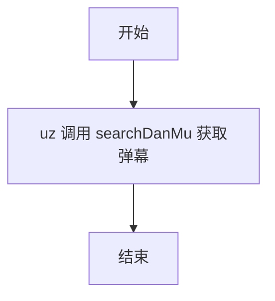

- [扩展说明](#扩展说明)
- [模板](#模板)
  - [uzUtils.js 提供网络、存储、toast 等功能](#uzutilsjs-提供网络存储toast-等功能)
- [视频源 type:101 扩展运行说明](#视频源-type101-扩展运行说明)
- [uzHome(首页推荐 type:200) 扩展运行说明](#uzhome首页推荐-type200-扩展运行说明)
- [panTools(网盘工具 type:300)扩展运行说明](#pantools网盘工具-type300扩展运行说明)
- [danMu(弹幕 type:400) 扩展运行说明](#danmu弹幕-type400-扩展运行说明)
- [加密说明](#加密说明)
- [修改记录](#修改记录)
    - [v1.6.46](#v1646)
    - [v1.6.43](#v1643)
    - [v1.6.42](#v1642)
    - [v1.6.41](#v1641)
    - [v1.6.40](#v1640)
    - [v1.6.35](#v1635)
    - [v1.6.31](#v1631)
    - [v1.6.20](#v1620)
    - [v1.6.00](#v1600)
    - [v1.5.50](#v1550)
    - [v1.5.40](#v1540)
    - [v1.4.00](#v1400)
    - [v1.3.00](#v1300)

# 扩展说明

1. 感谢您的关注，由于作者对 `js` 了解甚少，所以内置的代码不够全面。**如果您要编写 uz 可执行的扩展需要添加代码或其他问题，可以联系[机器人](https://t.me/uzVideoAppbot)**
2. `uzVideo.js` 为视频源扩展，提供观看视频的能力。内部定义了一些类和方法，您需要在扩展中实现 `WebApiBase` 的所有方法。
3. `uzHome.js` 为首页推荐扩展，提供视频推荐能力。
4. uz 内部仅有一个运行时，所有 `js` 代码（包括扩展）都在一起加载执行。所以您的扩展内类名一定要特殊，实例名称也要特殊
5. 不支持 `import` `export`
6. 集成库可在 `uz3lib.js` 查看，如需添加其他库通用库请联系[机器人](https://t.me/uzVideoAppbot)
7. 成对使用 `// ignore` uz 内部会忽略包裹的内容

# 模板
1. [视频源扩展 type:101 模板](https://github.com/YYDS678/uzVideo-extensions/tree/main/core/template/vod101.js)
2. [ 推荐页扩展 type:200 模板](https://github.com/YYDS678/uzVideo-extensions/tree/main/core/template/uzHome.js)
3. [网盘工具扩展 type:300 模板](https://github.com/YYDS678/uzVideo-extensions/tree/main/core/template/panTools.js)
4. [弹幕扩展 type:400 模板](https://github.com/YYDS678/uzVideo-extensions/tree/main/core/template/danMu.js)


## [uzUtils.js 提供网络、存储、toast 等功能](https://github.com/YYDS678/uzVideo-extensions/tree/main/core/uzUtils.js)

# 视频源 type:101 扩展运行说明

1. 执行每个方法都会为 `webSite` 进行赋值
2. json 文件说明

```
{
  "name": "名称",
  "codeID": "如果选择了加密请填写，由 uz 生成",
  "api": "扩展链接",
  "webSite": "视频站地址。当加载代码时会赋值给对象的 webSite 属性，用户可自行在 app 内修改",
  "remark": "备注",
  "noHistory": false, // *不开启*历史记录 默认false(即开启历史记录)，用户可自行在 app 内修改
  "userAgent": "", // 设置播放ua 优先级低于 getVideoPlayUrl 返回ua，用户可自行在 app 内修改
  "isLock": false, // 是否上锁 默认false(即不上锁)，用户可自行在 app 内修改
  "blockClassList": ["短剧"], // 屏蔽分类，用户可自行在 app 内修改
  "env":"",//环境变量名称1##环境变量描述1&&环境变量名称2##环境变量描述2
  "version": 1, //扩展版本号
  "type":101 // 视频扩展固定 101
}
```

3. 流程图



# uzHome(首页推荐 type:200) 扩展运行说明

1. 固定实例名称为 `uzHomeJs` （例如 const uzHomeJs = new UZHomeJS();）
2. json 文件说明

```
{
  "name": "名称",
  "codeID": "如果选择了加密请填写，由 uz 生成",
  "url": "扩展链接",
  "env":"",//环境变量名称1##环境变量描述1&&环境变量名称2##环境变量描述2
  "version": 1, //扩展版本号
  "type":200 //推荐扩展固定 200
}
```

3. 如需添加更多 UI 类型，请联系[机器人](https://t.me/uzVideoAppbot)
4. 流程图



# panTools(网盘工具 type:300)扩展运行说明

1. 固定实例名称为 `uzPanToolsInstance`
2. uz 运行时仅存在一个网盘工具，请尽量整合所有的解析在 PanTools
3. json 文件说明

```
{
  "name": "名称",
  "codeID": "如果选择了加密请填写，由 uz 生成",
  "url": "扩展链接",
  "env":"",//环境变量名称1##环境变量描述1&&环境变量名称2##环境变量描述2
  "version": 1, //扩展版本号
  "type":300 // 网盘工具扩展固定 300
}
```

4. 流程图



# danMu(弹幕 type:400) 扩展运行说明
1. 请勿删减 `danMuEmpty.js`  原有代码
2. `danMuEmpty.js` 代码为示例，您需要根据您的业务逻辑进行修改。参考 `danMu.js`
3. json 文件说明

```
{
  "name": "名称",
  "codeID": "如果选择了加密请填写，由 uz 生成",
  "url": "扩展链接",
  "env":"",//环境变量名称1##环境变量描述1&&环境变量名称2##环境变量描述2
  "version": 1, //扩展版本号
  "type":400 // 弹幕扩展固定 400
}
```

4. 流程图



# 加密说明

1. 您的扩展代码由 uz 进行加密，并生成 `codeID` 用于扩展解密。
2. `codeID` 每次都是随机生成，不可指定。请将 `codeID` 添加进 `json` 文件内。
3. app 设置页 `sid` 为用户标识，卸载、重置等情况下可能会发生变化。
4. `VerifyLink` `SaltApp2Backend` `SaltBackend2App` 为选填项，用于控制谁 `sid` 可以添加使用您开发的扩展。(仅在添加时进行验证)。
5. 推荐使用 `cloudflare worker` 进行验证。
6. 验证相关代码请见 `verifyServer.js` 请注意修改 `salt` 及 `sid` 验证逻辑。

# 修改记录

### v1.6.46
1. `getVideoPlayUrl` 支持返回弹幕数据 `RepVideoPlayUrl.danMu`
2. `UZArgs` 新增 `flag` 参数,取自 `vod_play_from`. 用于 `getVideoPlayUrl` 时获取当前线路。

### v1.6.43
1. 新增`kLocale` 获取用户当前 语言-地区
2. 新增 `kAppVersion` 获取用户当前 app 版本号
3.  新增弹幕扩展 `danMu.js` type:400

### v1.6.42

1. `goToVerify` 链接的 `host` 只在和用户当前选中源的 `webSite` 的 `host` 一致时 才会触发小窗验证。
2. 支持获取当前运行平台 `kIsDesktop` `kIsAndroid` `kIsIOS` `kIsWindows` `kIsMacOS` `kIsTV`

### v1.6.41

1. 新增 `type:101` 类型视频源扩展支持，不再推荐 `type:100` 类型扩展。

### v1.6.40

1. 增加 `openWebToBindEnv` 函数。跳转网页，由用户选择绑定环境变量
2. `req` 网络请求支持设置 `addressType`

### v1.6.35

1. `json` 配置增加 `type` 字段 100 为视频源扩展、200 为推荐扩展、300 为网盘工具扩展。增加 `version` 字段为扩展版本号。
2. 环境变量 `getEnv` `setEnv` 仅支持在 `json` 中声明 `env` 后调用，否则调用不生效。(持久存储请调用 `UZUtils.setStorage` `UZUtils.getStorage`)

### v1.6.31

1. 新增 `UZUtils.setStorage` 和 `UZUtils.getStorage` 用于持久化存储数据，不同于 `getEnv` 和 `setEnv` 不会触发通知。
2. `goToVerify` 验证函数增加 `ua` 参数。

### v1.6.20

1. 新增 `toast(msg,duration)` 函数，展示提示

### v1.6.00

1. `VideoDetail` 去除 `quarkUrl` 新增 `panUrls` 网盘分享链接列表
2. `WebApiBase`、`HomeTabModel` 新增 `uzTag` 字段用于存取环境变量，请勿修改值
3. 新增 `getEnv(uzTag, key)` 函数用于读取环境变量
4. 新增 `setEnv(uzTag, key, value, summary)` 用于新增或更新环境变量
5. 新增 `goToVerify` 用于验证视频站，会自动保存 `cookie` 下次请求自动生效。

### v1.5.50

1. 支持使用 uz 加密扩展，加密后请将 `codeID` 填写在 `json` 文件内。
2. 新增首页推荐扩展类型 `uzHome.js`

### v1.5.40

1. `req` 支持设置 `responseType` 值为字符串 `json、arraybuffer、bytes、plain、stream`
2. `vod_pic` 支持 data url 格式
3. `RepVideoPlayUrl.data` 支持 data url 格式

### v1.4.00

1. 增加二级分类和筛选列表功能

### v1.3.00

1. 去掉 `cat.js`, 更改为 `cheerio` `Crypto` `Encrypt` `parse(后期可能会移除，推荐优先使用 cheerio)`
2. `VideoDetail` 新增 `quarkUrl` 支持夸克网盘
3. `RepVideoPlayUrl` 新增 `headers` 支持设置播放 `header`
